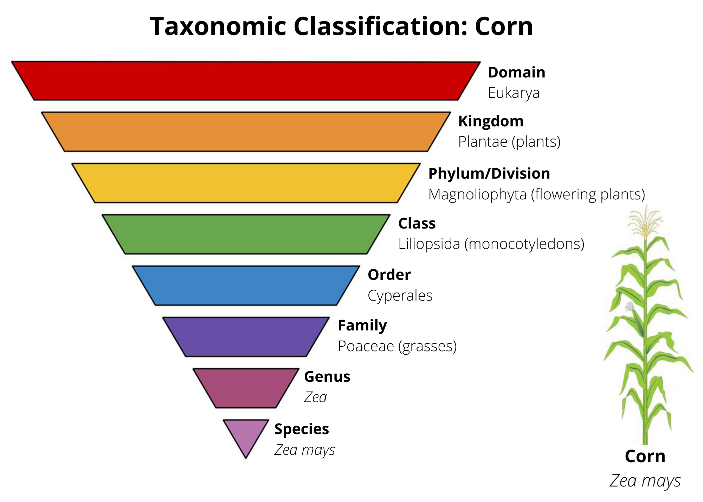
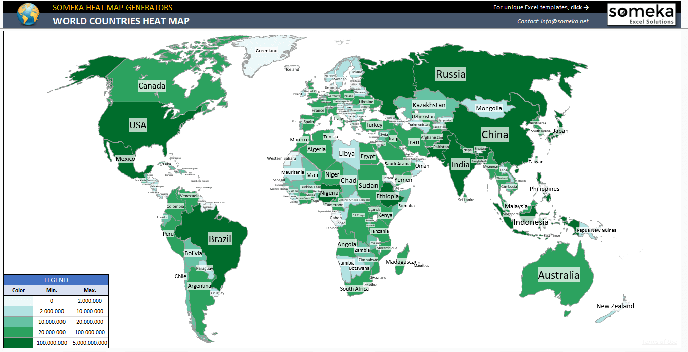

# species-project

**Topic:** Plant and Fungi Global Biodiversity 

**Goal:** Build a dashboard to display the location of different plants and fungi around the world.

 
**Data Sources:** 

Plant API: https://docs.trefle.io/docs/examples/snippets

Fungi dataset: https://springernature.figshare.com/collections/GlobalFungi_Global_database_of_fungal_records_from_high-throughput-sequencing_metabarcoding_studies/4915392

**Data Collection Process:** 

We collected our plant data using the Trefle API and extracted species count by region. Due to the large amount of data, we had to download several individual JSONs and load them into SQLite. Our fungi data was exracted using a CSV.

**Visualizations:**

Plants:

Map with biodiversity (count of species) per region with L1 - L3. The levels indicate what type of view the map provides. Level 1 displays a more hollistic map of the world, while level 3 displays a state view. The map is driven by count, so ultimately the colors indicate the varying levels of plant diversity across the world. The multiple views not only allow viewers to see plant diversity across the world, but also in areas that are native to them.

Fungi:

Heat map displaying count of fungi by location. The heat map is driven by count, so the areas of the globe that are more densely populated with fungi appear darker than those with a lesser amount. This allows the viewer to understand the areas that are most heavily populated.

Sample Heat Map:

